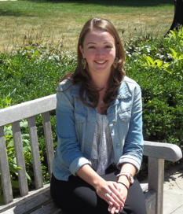
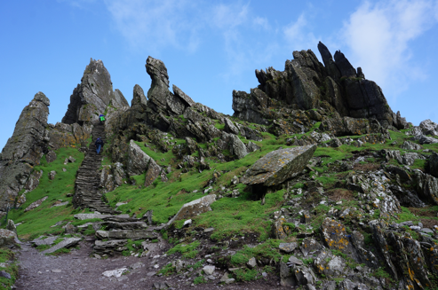
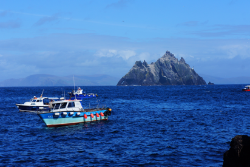
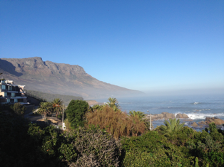
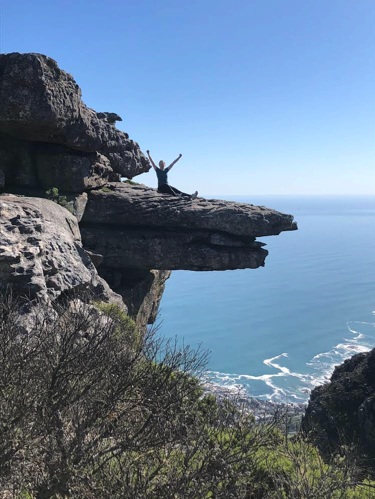
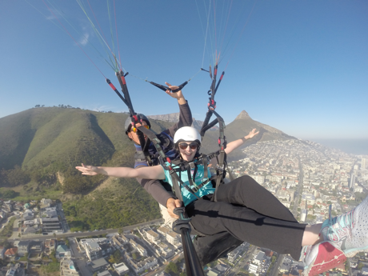

## About Me 

I am a fourth year PhD student in Developmental Psychology at the University of Chicago working with Dr. Amanda Woodward and Dr. Susan Goldin-Meadow. I am interested in early infant social cognition. In my dissertation, I am exploring infant social networks - I hope to describe the nature and structure present in infant social relationships as well as explore how social relationships impact early social cognition. 

Feel free to contact me at nicoleburke@uchicago.edu. 

## Background 

I graduated with a B.A. in Psychology and Cognitive Science from Northwestern University in 2015. As an undergraduate, I worked with Dr. Amy Booth and Dr. Sandra Waxman at Northwestern and Dr. Frank Keil at Yale University studying word learning, language development, children’s causal reasoning, and adult’s reasoning about explanatory depth.

## Interests beyond science 

Long distance runner, triathlete, R-ladies Chicago, travel  

 

Skellig Michael - an island off the southwest coast of Ireland. Also, "The Place Star Wars was filmed!"

 

Cape Town, South Africa. I was able to do some exploring after an amazing ISGS! 

  

